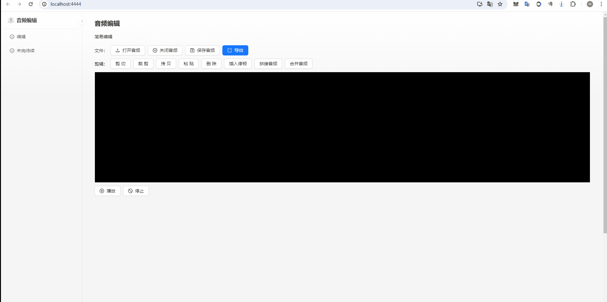

# <p align="center">基于web的音视频编辑器</p>

[//]: # (https://github.com/ikatyang/emoji-cheat-sheet 表情仓库)


## 🎞️ 项目介绍

> UI 使用react开发，UI库使用antd。[项目地址](https://github.com/liumengniu/audio-editor). \
> 音频剪辑使用 ffmpeg 开发。 \
> 波形图基于 wavesurfer.js开发 。 \
> 由于浏览器对于文件操作的限制以及浏览器运行内存大小的限制，纯web端实现不如客户端实现 。 \
> 以下是项目原始示例，未经任何修改：
> 


## 🎨 运行指南

> 项目运行需要node环境 ，推荐node14+，作者使用的是node 16.13.1

> 1. 安装依赖

```bash
   npm install
```

> 2. 运行项目

```bash
   npm run start
```

> 3. 编译项目

```bash
   npm run build
```

## 💡 优化清单
> 需要优化的内容 2024/4/10
>
| 蓝图                       | 完成情况       | 存在问题        |
|--------------------------|------------|-------------|
| 1、通过electron桌面框架再实现一套        | pending    | 常规的组件就这些，有哪些特殊问卷组件没有，可以提issue  |

## 🌟 Star History
<br>

[](https://star-history.com/#liumengniu/audio-editor&Timeline)


